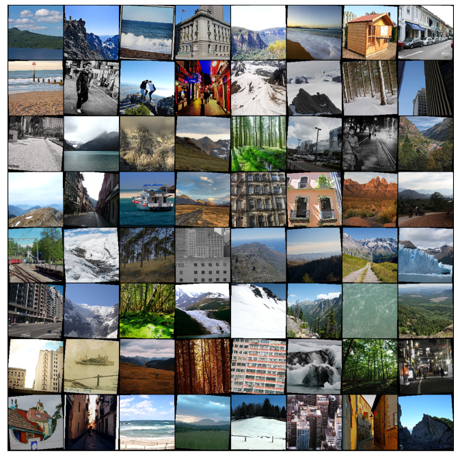

# Scenario classification using ResNets
> This project was made as part of [Deep Learning with PyTorch: Zero to GANs course](https://jovian.ml/learn/deep-learning-with-pytorch-zero-to-gans). 
This is an implemetation of ResNets using Pytorch for image classification of varios escenarios. For a detailed breakdown of the development, the code and the results read my [Medium blogpost](https://medium.com/jovianml/using-resnet-for-image-classification-4b3c42f2a27e). You can also interact with the project directly on [Jovian.ml](https://jovian.ml/linkenny13/project)

## Table of contents
* [General info](#general-info)
* [Screenshots](#screenshots)
* [Setup](#setup)
* [Features](#features)
* [Status](#status)
* [Inspiration](#inspiration)
* [Contact](#contact)

## General info
There are many ways of tackling an image classification problem using ML, even for simple problems, the current ML landscape presents us many options from simple linear Neural Networks to bigger more complex architectures. On this project, I used the [Intel image classification dataset](https://www.kaggle.com/puneet6060/intel-image-classification) hosted on Kaggle, this dataset was initially created by Intel for an image classification challenge. The dataset contains about 25k images divided on 14k for training, 3k for testing (validation), and 7k used in the original challenge for the participants to make their predictions. On this project i use Residual neural networks (ResNet) for Image classification to test the accuracy they present for these images, first creating it piece by piece and then importing and adapting a pre-trained ResNet, all using PyTorch as framework.

## Screenshots

<iframe src="https://jovian.ml/embed?url=https://jovian.ml/linkenny13/project/v/5&cellId=20" title="Jovian Viewer" height="760" width="800" frameborder="0" scrolling="auto"></iframe>

## Setup
Necessary libraries:
    *Numpy*
    *Pandas*
    *Matplotlib*
    *Pytorch*

To run it either download the dataset and set the path on the notebook or run it directly on Kaggle importing the dataset to the project directory.

## Status
Project is: _finished_

## Contact
Created by [@KennyJaimes](https://www.linkedin.com/in/kennyjaimes/) - feel free to contact me!